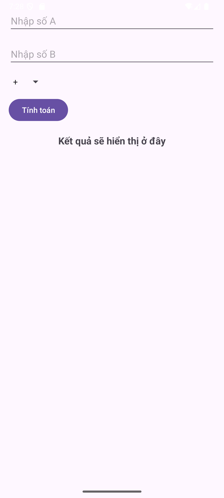
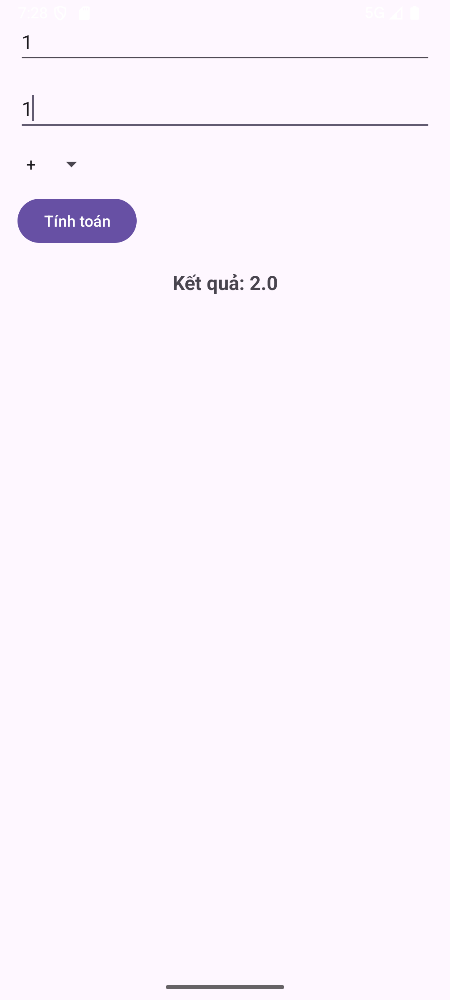
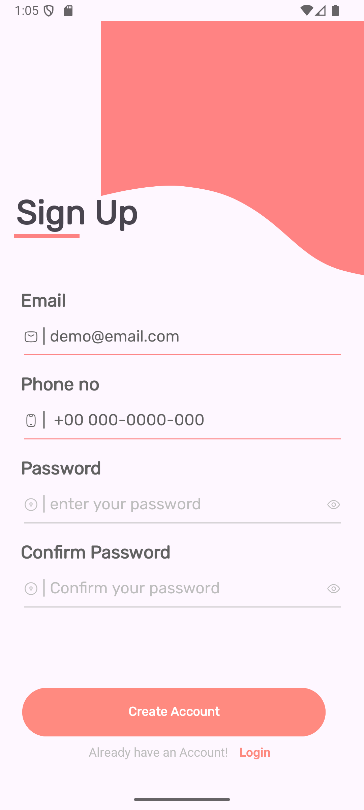
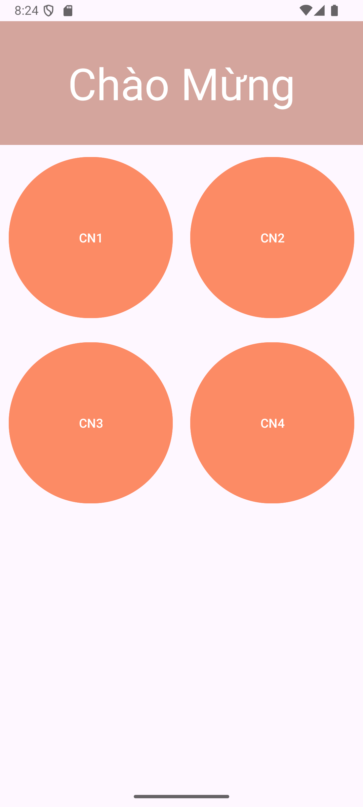
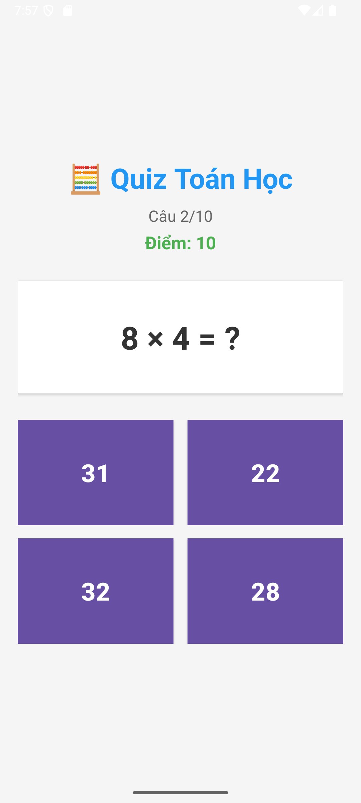
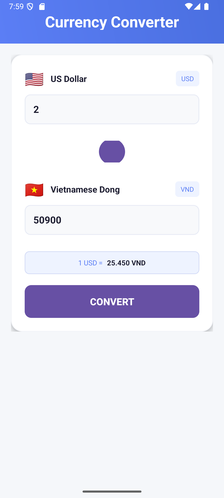
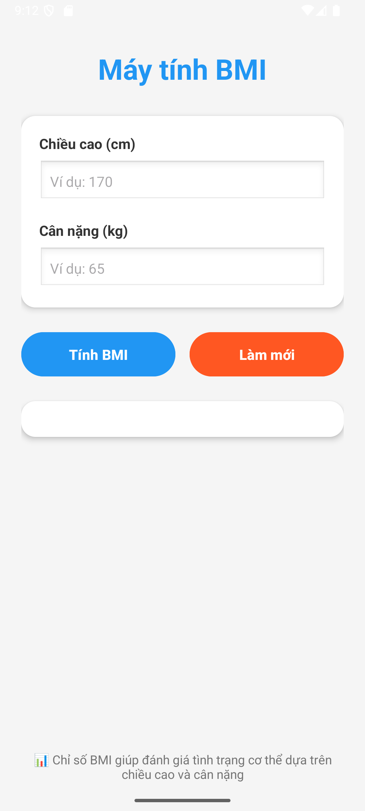
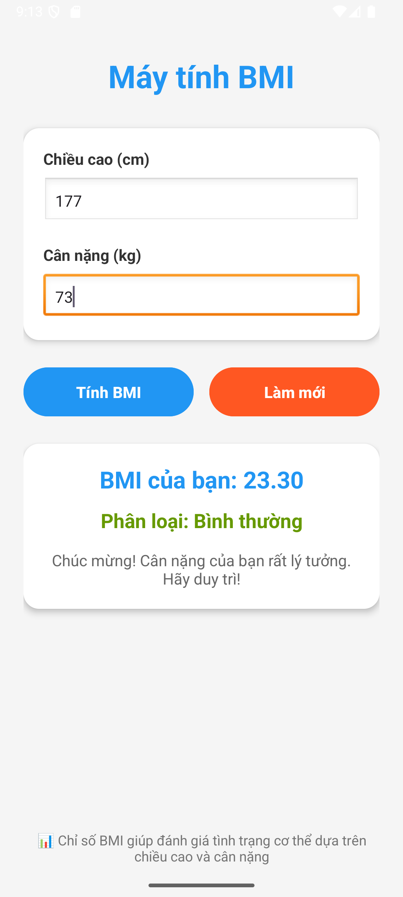

📒 **BTAndroid**

Đây là nơi lưu các **bài tập & bài thực hành** trong quá trình học môn *Lập trình thiết bị di động*.

---

## 1️⃣ [**Hello Android**](https://github.com/Mellow2512/BTAndroid/tree/main/HelloAndroid)

* Bài tập demo đầu tiên trong học phần.
* Ứng dụng chỉ hiển thị dòng chữ **"Hello Android"** trên màn hình.
* Giúp làm quen với cấu trúc dự án Android Studio.

---

## 2️⃣ [**ViDuLayout1**](https://github.com/Mellow2512/BTAndroid/tree/main/VDLayout1)

* Bài tập luyện tập với **ConstraintLayout**.
* Học cách sắp xếp các thành phần giao diện theo quan hệ ràng buộc.

---

## 3️⃣ [**lamthemSimpleMath**](https://github.com/Mellow2512/BTAndroid/tree/main/lamthemSimpleMath)

* Ứng dụng **máy tính đơn giản** với các phép tính cơ bản: cộng (+), trừ (-), nhân (×), chia (÷).
* Người dùng nhập số A, số B → chọn phép tính → hiển thị kết quả.

### * Màn hình giao diện trước khi tính toán:

### * Sau khi tính toán:

---

## 4️⃣ [**LoginScreen**](https://github.com/Mellow2512/BTAndroid/tree/main/LoginScreen)

* Giao diện đăng nhập dành cho người dùng bắt mắt và thân thiện:

---

## 5️⃣ [**VDLayout2**](https://github.com/Mellow2512/BTAndroid/tree/main/VDLayout2)

* Bài tập làm quen với **LinearLayout**.
* Giao diện với 4 nút chức năng cơ bản:

---

## 6️⃣ [**SimpleQuiz**](https://github.com/Mellow2512/BTAndroid/tree/main/SimpleQuiz)

* Ứng dụng Quiz đơn giản, chọn đáp án đúng(10 câu Toán cơ bản):

---

## 7️⃣ [**CurrencyCalculator**](https://github.com/Mellow2512/BTAndroid/tree/main/CurrencyConverter)

* Chương trình chuyển đổi tiền tệ từ USD -> VND.
* Giao diện thuận mắt và dễ sử dụng:

---

## 8️⃣ [**BMICalculator**](https://github.com/Mellow2512/BTAndroid/tree/main/BMICalculator)

* Kiểm tra tình trạng sức khỏe với ứng dụng tính BMI, với các mức **Thiếu cân**, **Bình thường**, **Thừa cân**, **Béo phì**.
* Trước khi tính toán được tình trạng sức khỏe:

* Sau khi tính toán được tình trạng sức khỏe:

---

✨ *README này sẽ được cập nhật khi có thêm bài tập mới.*
